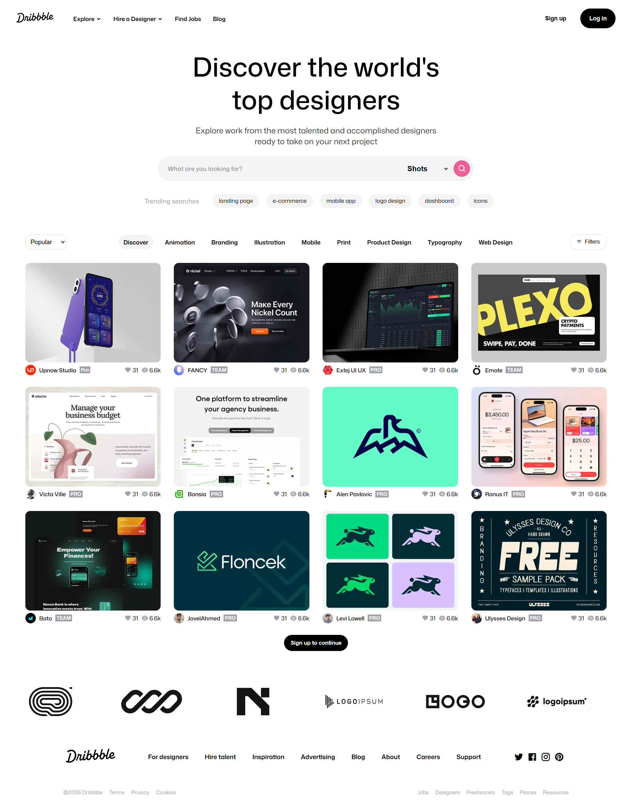

# Dribbble Clone UI 🎨

A modern **Dribbble-inspired landing page UI** built using **semantic HTML5** and **modern CSS3**.  
This project recreates the clean aesthetics, interactive design cards and hover effects inspired by the official Dribbble website.

---

## 🚀 Live Demo

🌐 **Live Site:**  
https://harshaweb09.github.io/dribbble-clone-ui/

---

## 📸 Preview



---

## ✨ Features

- Modern Dribbble-inspired UI
- Navigation bar
- Trending searches
- Design inspiration cards
- Hover overlay animations
- Infinite scrolling brand carousel
- Clean footer and secondary navigation
- Semantic HTML structure
- Smooth CSS transitions & animations

---

# 🛠️ Tech Used

- HTML5
- CSS3
- CSS Grid
- Flexbox
- CSS Animations
- CSS Transitions
- Remix Icons
- Google Fonts

---

# 📚 Key Learnings

This project helped me practice and improve my understanding of:

## 🎯 HTML Concepts

- Semantic HTML structure
- Organizing reusable UI sections
- Meta SEO tags

## 🎨 CSS Concepts

- Flexbox layouts
- CSS Grid layouts
- Positioning techniques
- Hover states & transitions
- CSS animations using `@keyframes`
- Gradient overlays
- Custom buttons

## ⚡ Animations & Interactions

- Hover reveal effects
- Smooth transitions
- Infinite horizontal scrolling carousel
- Interactive design cards
- Icon hover animations

## 🧠 UI/UX Understanding

- Layout balancing
- Visual hierarchy
- Modern typography usage
- Spacing consistency
- Card-based design systems

---

# 📂 Folder Structure

```bash
dribbble-clone-ui/
│
├── assets/
│   ├── images
│   ├── videos
│   └── icons
│
├── index.html
├── style.css
├── preview.png
└── README.md
```

---

# ⚙️ Installation

Clone the repository:

```bash
git clone https://github.com/harshaweb09/dribbble-clone-ui.git
```

Open the project folder:

```bash
cd dribbble-clone-ui
```

Run using Live Server or simply open `index.html`.

---

# 🙌 Acknowledgements

- Inspired by https://dribbble.com
- Icons by https://remixicon.com
- Fonts by https://fonts.google.com

---

# 👨‍💻 Author

**Katari Harsha Vardhan Reddy**

- GitHub: https://github.com/harshaweb09
- LinkedIn: https://www.linkedin.com/in/harsha-vardhan-reddy-katari/

---

# 📄 License

This project is created for educational and learning purposes only.
